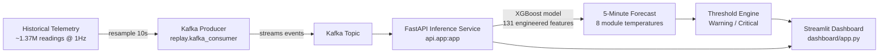

# 🛰️ SentinelDC — Simulated Real-Time Data Center Thermal Monitoring & 5-Minute Forecasting

**A production-style ML system that predicts data center rack temperatures 5 minutes into the future — before they become a problem.**

SentinelDC ingests live telemetry, streams it through Kafka, forecasts the temperature of 8 hardware modules 5 minutes ahead using XGBoost, and surfaces real-time alerts on a live Streamlit dashboard — powered by a FastAPI inference service.

> Built on ~1.37M real sensor readings from a live data center, spanning 16 days of continuous telemetry.

---

## Why This Project Matters

Data center overheating causes hardware degradation, downtime, and costly emergency cooling. Most monitoring systems are **reactive** — they alert *after* a threshold is crossed. SentinelDC is **predictive**: it forecasts thermal trends 5 minutes ahead so operators can act *before* a module overheats.

This project demonstrates an end-to-end ML engineering workflow — not just a notebook model, but a deployable pipeline:

`Sensor Telemetry → Kafka Stream → Feature Engineering → XGBoost Forecast → FastAPI → Live Dashboard`

---

## 🏗️ System Architecture



**Components:**

| Layer | Technology | Role |
|---|---|---|
| Streaming | Apache Kafka (`kafka-python`) | Replays historical telemetry as a live sensor feed |
| Serving | FastAPI + Uvicorn | Loads the trained model and serves real-time predictions |
| ML Core | XGBoost + scikit-learn | Multi-output regression forecasting 8 module temperatures |
| Dashboard | Streamlit + `streamlit-autorefresh` | Live-updating monitoring UI with alert states |
| Data | Pandas / NumPy | Resampling, feature engineering, validation |

---

## 📊 Model Performance

The model was benchmarked against a **persistence baseline** (the industry-standard "naive" forecast: *"in 5 minutes, it'll be about what it is now"*) and a moving-average baseline, on a held-out chronological test set.

| Model | MAE (°C) | RMSE (°C) | R² |
|---|---|---|---|
| Persistence baseline | 0.698 | 1.373 | -0.923 |
| Moving average (60s) | 0.698 | 1.368 | -0.932 |
| Linear Regression | 0.671 | 0.930 | -4.472 |
| **XGBoost (final model)** | **0.372** | **0.708** | **0.262** |

✅ **46.8% MAE improvement over the persistence baseline** — a meaningful, validated lift for a genuinely hard 5-minute-ahead thermal forecasting task.

### Methodology highlights (see `notebooks/`)

- **No target leakage:** targets are defined by exact `timestamp + 5 minutes` lookups — not a naive `shift(30)` — with an automated assertion verifying every training example is exactly a +300s horizon.
- **Chronological 70/15/15 split** — no shuffling, no data leakage from the future into training.
- **131 leak-free engineered features** built only from present/past telemetry (lag features from 10s to 5min, rolling statistics, multi-module temperature and power signals).
- **8 independent module forecasts** via `MultiOutputRegressor`, each with its own feature importance profile.
- **Baselines-first discipline:** persistence and moving-average baselines are computed and enforced as a floor the model must beat before being accepted.
- Final production model is retrained on train + validation (test set held out purely for reporting) and shipped with a versioned `model_metadata.json` for reproducibility.

---

## 📁 Dataset

- **Source:** Live data center sensor telemetry, 8 hardware modules, multi-channel temperature + power sensors
- **Raw volume:** 1,371,363 readings @ ~1 Hz (Sept 16 – Oct 2, 2024)
- **Modeling cadence:** Resampled to 10-second intervals (137,128 rows) to reduce noise while preserving thermal dynamics
- **Forecast horizon:** Exactly 5 minutes (30 steps at 10s cadence)

---

## 🚀 Running the Project Locally

The system runs as three cooperating services. Open three terminals:

**1. Environment setup**
```bash
python -m venv .venv
.venv\Scripts\activate        # Windows
# source .venv/bin/activate   # macOS/Linux

pip install -r requirements.txt
```

**2. Start the Kafka telemetry replay (Terminal 1)**
```bash
python -m replay.kafka_consumer
```
Streams the historical dataset as a live sensor feed, simulating real-time telemetry.

**3. Start the inference API (Terminal 2)**
```bash
uvicorn api.app:app --reload
```
Loads the trained XGBoost model and serves 5-minute-ahead forecasts.

**4. Launch the live dashboard (Terminal 3)**
```bash
streamlit run dashboard/app.py
```
Displays real-time temperature trends, forecasts, and threshold-based alerts for all 8 modules.

> ⚠️ Requires a running Kafka broker (e.g. via Docker) accessible to `replay.kafka_consumer` and the API layer.

---

## 🧠 Alerting

Warning/critical thresholds are derived from historical percentiles (95th / 99th) per module and shipped as `temperature_thresholds.json`. These are **demonstration thresholds** — in a real deployment they should be replaced with thresholds from actual hardware thermal specifications.

---

## 🗂️ Project Structure

```
Sentinel_data_centre_monitoring/
├── api/                    # FastAPI inference service
│   └── app.py
├── replay/                 # Kafka producer/consumer for telemetry replay
│   └── kafka_consumer.py
├── dashboard/               # Streamlit live monitoring UI
│   └── app.py
├── data/
│   ├── raw/                 # Original 1Hz telemetry
│   └── processed/            # 10s resampled + forecasting dataset
├── models/                  # Trained XGBoost model, feature list, metadata, thresholds
├── notebooks/                # Model development & evaluation notebook
├── requirements.txt
└── README.md
```
*(Adjust to match your exact repo layout if it differs.)*

---

## 🔮 Future Improvements

- [ ] Swap historical-percentile thresholds for equipment-certified safety limits
- [ ] Add model drift monitoring / automated retraining trigger
- [ ] Containerize all three services with Docker Compose for one-command startup
- [ ] Add confidence intervals / quantile forecasts alongside point predictions
- [ ] CI pipeline for model validation on every retrain

---

## 🛠️ Tech Stack

`Python` · `XGBoost` · `scikit-learn` · `Pandas` · `NumPy` · `FastAPI` · `Uvicorn` · `Kafka` · `Streamlit` · `Pydantic` · `Joblib`

---

## 👤 Author

**Kashish Pundir**
Feel free to connect or reach out with questions about the architecture or modeling approach.
